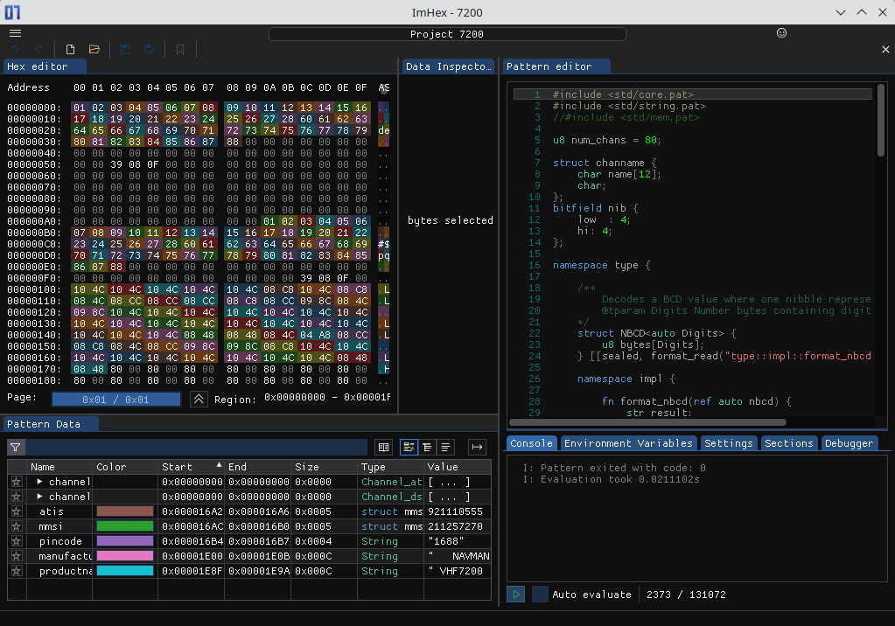

# Navman 7200, "marine VHF EEPROM contents



## Channels

Adjusting channels should be the most interesting.

There is a `tunetx` uint16 field and a `tunerx` uint16 field.

A change by 1 seems to correspond to a change 12.5kHz, as the difference is typically 4 for adjacent channels which corresponds to the 50kHz spacing. There can also be observed a 25kHz spacing on some channels.

To add a channel, you should take the bitfield settings `bf1` of a known channel and use this as starting point. I was too lazy and lost interest in figuring out. There is also a nibble in `bf` which corresponds to the HI/LO setting, but it is changed in it entirety when adjusting HI/LO on the radio, so it might be a bug or an artifact of the firmware.

You can see some explorations below to figure out some more settings like buddy lists, tracking, etc.

To just _reset the MMSI/ATIS_, this is not needed, as you could always turn on the radio with ESC+SCAN kept pressed. The PIN code is 1688 or 7100 if unchanged. If pin code had been changed, it can be found at offset 0x16b4 as ASCII (4 bytes).

## Exploring the EEPROM contents

EEPROM changes were observed by making an adjustment in the radio, pulling the eeprom, reading its contents, and comparing it to the previous content.

[ImHex](https://github.com/WerWolv/ImHex) was used as a (very cool) hex editor.

The layout and addresses are a bit strange. Also there are no provisions for wear-leveling. Some stuff like HI/LO changes on the radio or last used channel is written to EEPROM, but the radio does not make use of it when power-cycling.

## [7200_00](7200_00.ihex)

  1. hold ESC+SCAN then turn on
  2. Reset DSC
  3. Reset ATIS
  4. turn off
  5. turn on
  6. Menu -> Reset Radio

### DSC Channels
  1.    01, "PHONE-PORTOP", D, LO
  2.    02, "PHONE-PORTOP", D, LO
  3.    03, "PHONE-PORTOP", D, LO
  4.    04, "PHONE-PORTOP", D, LO
  5.    05, "PHONE-PORTOP", D, LO
  6.    06, "SAFETY", , LO
  7.    07, "PHONE-PORTOP", D, LO
  8.    08, "SHIP-SHIP", , LO
  9.    09, "SHIP-SHIP", , LO
  10.   10, "SHIP-SHIP", , LO
  11.   11, "PORT OPS", , LO
  12.   12, "PORT OPS", , LO
  13.   13, "SAFETY COM", , LO
  14.   14, "PORT OPS", , LO
  15.   15, "PORT OPS", , LO
  16.   16, "DISTRESS",  , HI, CH1, PRI
  17.   17, "PORT OPS", , LO
  18.   18, "PHONE-PORTOP", D, LO
  19.   19, "PHONE-PORTOP", D, LO
  20.   20, "PHONE-PORTOP", D, LO
  21.   21, "PHONE-PORTOP", D, LO
  22.   22, "PHONE-PORTOP", D, LO
  23.   23, "PHONE-PORTOP", D, LO
  24.   24, "PHONE-PORTOP", D, LO
  25.   25, "PHONE-PORTOP", D, LO
  26.   26, "PHONE-PORTOP", D, LO
  27.   27, "PHONE-PORTOP", D, LO
  28.   28, "PHONE-PORTOP", D, LO
  29.   60, "PHONE-PORTOP", D, LO
  30.   61, "PHONE-PORTOP", D, LO
  31.   62, "PHONE-PORTOP", D, LO
  32.   63, "PHONE-PORTOP", D, LO
  33.   64, "PHONE-PORTOP", D, LO
  34.   65, "PHONE-PORTOP", D, LO
  35.   66, "PHONE-PORTOP", D, LO
  36.   67, "SHIP-SHIP", , LO
  37.   68, "PORT OPS", , LO
  38.   69, "SHIP-SHIP", , LO, CH2
  39.   70, "DSC", , ,
  40.   71, "PORT OPS", , LO
  41.   72, "SHIP-SHIP", , LO, CH3
  42.   73, "SHIP-SHIP", , LO,
  43.   74, "PORT OPS", , LO
  44.   75, "PORT OPS", , L
  45.   76, "PORT OPS", , LO
  46.   77, "SHIP-SHIP", , LO
  47.   78, "PHONE-PORTOP", D, LO
  48.   79, "PHONE-PORTOP", D, LO
  49.   80, "PHONE-PORTOP", D, LO
  50.   81, "PHONE-PORTOP", D, LO
  51.   82, "PHONE-PORTOP", D, LO
  52.   83, "PHONE-PORTOP", D, LO
  53.   84, "PHONE-PORTOP", D, LO
  54.   85, "PHONE-PORTOP", D, LO
  55.   86, "PHONE-PORTOP", D, LO
  56.   87, "PORT OPS", , LO
  57.   88, "PORT OPS", , LO


## [7200_001](7200_001.ihex)

  1. turn on
  2. Menu -> DSC -> Atis Func -> on

```
--- 7200_000.ihex	2024-01-12 20:12:06.276268048 +0100
+++ 7200_001.ihex	2024-01-12 20:50:51.334659696 +0100
@@ -329 +329 @@
-:10148000010F0000020F0300000001000000000037
+:10148000010F0000020F0300000002000000000036
@@ -486 +486 @@
-:101E50000000000505000100010000010100000173
+:101E50000000000505000101000000010100000173
```

## [7200_002](7200_002.ihex)

  1. revert to 7200_000
  2. active channel 16 -> 15

```
--- 7200_000.ihex	2024-01-12 20:12:06.276268048 +0100
+++ 7200_002.ihex	2024-01-12 20:57:53.729791799 +0100
@@ -329 +329 @@
-:10148000010F0000020F0300000001000000000037
+:10148000010E0000020F0300000001000000000038
@@ -512 +512 @@
-:101FF000000000000000000000AA8004000FAA00FA
+:101FF000000000000000000000AA80040E0FAA00EC
```

## [7200_003](7200_003.ihex)

 After power cycle, channel 16 is selected again.

 @0x1ffc: 00 when reset all, else channel number (0xf=16)

```
--- 7200_002.ihex	2024-01-12 20:57:53.729791799 +0100
+++ 7200_003.ihex	2024-01-12 21:07:27.308648600 +0100
@@ -329 +329 @@
-:10148000010E0000020F0300000001000000000038
+:10148000010F0000020F0300000001000000000037
@@ -512 +512 @@
-:101FF000000000000000000000AA80040E0FAA00EC
+:101FF000000000000000000000AA80040F0FAA00EB
```

## [7200_004](7200_004.ihex)

```
--- 7200_003.ihex	2024-01-12 21:07:27.308648600 +0100
+++ 7200_004.ihex	2024-01-12 21:23:13.057509939 +0100
@@ -325,2 +325,2 @@

  1. HI -> LO

  This seems to not being kept on a power cycle

-:101440000000555555555555555050555555555500
-:1014500055555555555055455455555555550500F7
+:1014400000004444444444444440404444444444EC
+:1014500044444444444044444444444444440400D4
```


## [7200_005](7200_005.ihex)

  1. LO -> HI

```
--- 7200_004.ihex	2024-01-12 21:23:13.057509939 +0100
+++ 7200_005.ihex	2024-01-12 21:26:09.475690013 +0100
@@ -325,2 +325,2 @@
-:1014400000004444444444444440404444444444EC
-:1014500044444444444044444444444444440400D4
+:101440000000555555555555555050555555555500
+:1014500055555555555055455455555555550500F7
```


## [7200_008](7200_008.ihex)

  1. Radio Setup -> Beep Volume -> Off

```
--- 7200_007.ihex	2024-01-12 21:33:49.271696141 +0100
+++ 7200_008.ihex	2024-01-12 21:36:18.762490653 +0100
@@ -488 +488 @@
-:101E70000001000000002B3030302B00000000007B
+:101E70000002000000002B3030302B00000000007A
```


## [7200_009](7200_009.ihex)

  1. Radio Setup -> Beep Volume -> High 

```
--- 7200_008.ihex	2024-01-12 21:36:18.762490653 +0100
+++ 7200_009.ihex	2024-01-12 21:37:27.577724949 +0100
@@ -488 +488 @@
-:101E70000002000000002B3030302B00000000007A
+:101E70000000000000002B3030302B00000000007C
```

## [7200_010](7200_010.ihex)

  1. Radio Setup -> Ring Volume -> Low (was: High)

```
--- 7200_009.ihex	2024-01-12 21:37:27.577724949 +0100
+++ 7200_010.ihex	2024-01-12 21:42:34.346808097 +0100
@@ -487,2 +487,2 @@
-:101E60000000000000000000012B30303030000086
+:101E60000001000000000000012B30303030000085
```


## [7200_011](7200_011.ihex)

  1. Menu -> Local -> Local (was: Distant)

```
--- 7200_010.ihex	2024-01-12 21:42:34.346808097 +0100
+++ 7200_011.ihex	2024-01-12 21:45:31.711968649 +0100
@@ -486 +486 @@
-:101E50000000000505000100010000010100000173
+:101E50000000000505000100010100010100000172
```


## [7200_012](7200_012.ihex)

  1. Menu -> Backlight 5 to 4

```
--- 7200_011.ihex	2024-01-12 21:45:31.711968649 +0100
+++ 7200_012.ihex	2024-01-12 21:47:13.891583036 +0100
@@ -486 +486 @@
-:101E50000000000505000100010100010100000172
+:101E50000000000405000100010100010100000173
```


## [7200_013](7200_013.ihex)

  1. Menu -> Backlight 4 to 8 (HI)

```
--- 7200_012.ihex	2024-01-12 21:47:13.891583036 +0100
+++ 7200_013.ihex	2024-01-12 21:48:24.896956143 +0100
@@ -486 +486 @@
-:101E50000000000405000100010100010100000173
+:101E5000000000080500010001010001010000016F
```


## [7200_014](7200_014.ihex)

  1. Menu -> Backlight 8 to 0 (LO)
```
--- 7200_013.ihex	2024-01-12 21:48:24.896956143 +0100
+++ 7200_014.ihex	2024-01-12 21:49:33.442252862 +0100
@@ -486 +486 @@
-:101E5000000000080500010001010001010000016F
+:101E50000000000005000100010100010100000177
```


## [7200_015](7200_015.ihex)

  1. Menu -> Backlight 0 to 5

```
--- 7200_014.ihex	2024-01-12 21:49:33.442252862 +0100
+++ 7200_015.ihex	2024-01-12 21:50:59.061365153 +0100
@@ -486 +486 @@
-:101E50000000000005000100010100010100000177
+:101E50000000000505000100010100010100000172
```


## [7200_016](7200_016.ihex)

  1. Menu -> Contrast 5 to 4 (possible values: 0..8)

```
--- 7200_015.ihex	2024-01-12 21:50:59.061365153 +0100
+++ 7200_016.ihex	2024-01-12 21:52:09.460037783 +0100
@@ -486 +486 @@
-:101E50000000000505000100010100010100000172
+:101E50000000000504000100010100010100000173
```


## [7200_017](7200_017.ihex)

  1. GPS/DATA -> TIME OFFSET -> +00:30

```
--- 7200_016.ihex	2024-01-12 21:52:09.460037783 +0100
+++ 7200_017.ihex	2024-01-12 21:55:41.062712877 +0100
@@ -487 +487 @@
-:101E60000001000000000000012B30303030000085
+:101E60000001000000000000012B30303030001E67
```


## [7200_018](7200_018.ihex)

  1. GPS/DATA -> TIME OFFSET -> +13:00 (max)

```
--- 7200_017.ihex	2024-01-12 21:55:41.062712877 +0100
+++ 7200_018.ihex	2024-01-12 21:57:03.758387561 +0100
@@ -487 +487 @@
-:101E60000001000000000000012B30303030001E67
+:101E60000001000000000000012B303030300D0078
```


## [7200_019](7200_019.ihex)

  1. GPS/DATA -> TIME OFFSET -> -00:30

```
--- 7200_018.ihex	2024-01-12 21:57:03.758387561 +0100
+++ 7200_019.ihex	2024-01-12 21:58:27.287416174 +0100
@@ -487 +487 @@
-:101E60000001000000000000012B303030300D0078
+:101E60000001000000000000012B30303030801EE7
```


## [7200_020](7200_020.ihex)

  1. GPS/DATA -> TIME OFFSET -> -13:00 (min)

```
--- 7200_019.ihex	2024-01-12 21:58:27.287416174 +0100
+++ 7200_020.ihex	2024-01-12 21:59:47.569683880 +0100
@@ -487 +487 @@
-:101E60000001000000000000012B30303030801EE7
+:101E60000001000000000000012B30303030F30092
```


## [7200_021](7200_021.ihex)

  1. GPS/DATA -> TIME OFFSET -> +00:00

```
--- 7200_020.ihex	2024-01-12 21:59:47.569683880 +0100
+++ 7200_021.ihex	2024-01-12 22:00:43.704601616 +0100
@@ -487 +487 @@
-:101E60000001000000000000012B30303030F30092
+:101E60000001000000000000012B30303030000085
```


## [7200_022](7200_022.ihex)

  1. GPS/DATA -> TIME FORMAT -> 12h

```
--- 7200_021.ihex	2024-01-12 22:00:43.704601616 +0100
+++ 7200_022.ihex	2024-01-12 22:02:14.640499760 +0100
@@ -486 +486 @@
-:101E50000000000504000100010100010100000173
+:101E50000000000504000100010100010000000174
```


## [7200_023](7200_023.ihex)

  1. GPS/DATA -> TIME FORMAT -> 24h

```
--- 7200_022.ihex	2024-01-12 22:02:14.640499760 +0100
+++ 7200_023.ihex	2024-01-12 22:03:17.382268209 +0100
@@ -486 +486 @@
-:101E50000000000504000100010100010000000174
+:101E50000000000504000100010100010100000173
```


## [7200_024](7200_024.ihex)

  1. GPS/DATA -> TIME DISPLAY -> OFF

```
--- 7200_023.ihex	2024-01-12 22:03:17.382268209 +0100
+++ 7200_024.ihex	2024-01-12 22:04:20.824055553 +0100
@@ -486 +486 @@
-:101E50000000000504000100010100010100000173
+:101E50000000000504000100010101010100000172
```


## [7200_025](7200_025.ihex)

  1. GPS/DATA -> TIME DISPLAY -> ON

```
--- 7200_024.ihex	2024-01-12 22:04:20.824055553 +0100
+++ 7200_025.ihex	2024-01-12 22:06:07.333721291 +0100
@@ -486 +486 @@
-:101E50000000000504000100010101010100000172
+:101E50000000000504000100010100010100000173
```


## [7200_026](7200_026.ihex)

  1. GPS/DATA -> LL DISPLAY -> OFF

```
--- 7200_025.ihex	2024-01-12 22:06:07.333721291 +0100
+++ 7200_026.ihex	2024-01-12 22:07:01.808587835 +0100
@@ -486 +486 @@
-:101E50000000000504000100010100010100000173
+:101E50000000000504000100010100010101000172
```


## [7200_027](7200_027.ihex)

  1. GPS/DATA -> LL DISPLAY -> ON

```
--- 7200_026.ihex	2024-01-12 22:07:01.808587835 +0100
+++ 7200_027.ihex	2024-01-12 22:07:43.066415445 +0100
@@ -486 +486 @@
-:101E50000000000504000100010100010101000172
+:101E50000000000504000100010100010100000173
```


## [7200_028](7200_028.ihex)

  1. GPS/DATA -> COG/SOG -> ON

```
--- 7200_027.ihex	2024-01-12 22:07:43.066415445 +0100
+++ 7200_028.ihex	2024-01-12 22:08:29.321050079 +0100
@@ -486 +486 @@
-:101E50000000000504000100010100010100000173
+:101E50000000000504000100010101000100000173
```


## [7200_029](7200_029.ihex)

  1. GPS/DATA -> COG/SOG -> OFF

```
--- 7200_028.ihex	2024-01-12 22:08:29.321050079 +0100
+++ 7200_029.ihex	2024-01-12 22:09:13.695631592 +0100
@@ -486 +486 @@
-:101E50000000000504000100010101000100000173
+:101E50000000000504000100010101010100000172
```


## [7200_030](7200_030.ihex)

  1. GPS/DATA -> GPS ALERT -> OFF

```
--- 7200_029.ihex	2024-01-12 22:09:13.695631592 +0100
+++ 7200_030.ihex	2024-01-12 22:09:52.070044161 +0100
@@ -487 +487 @@
-:101E60000001000000000000012B30303030000085
+:101E60000001000000000001012B30303030000084
```


## [7200_031](7200_031.ihex)

  1. DSC SETUP -> LL REPLY -> AUTO

```
--- 7200_030.ihex	2024-01-12 22:09:52.070044161 +0100
+++ 7200_031.ihex	2024-01-12 22:41:06.834347855 +0100
@@ -487 +487 @@
-:101E60000001000000000001012B30303030000084
+:101E60000001000001000001012B30303030000083
```


## [7200_032](7200_032.ihex)

  1. DSC SETUP -> LL REPLY -> OFF

```
--- 7200_031.ihex	2024-01-12 22:41:06.834347855 +0100
+++ 7200_032.ihex	2024-01-12 22:42:57.807423397 +0100
@@ -487 +487 @@
-:101E60000001000001000001012B30303030000083
+:101E60000001000002000001012B30303030000082
```


## [7200_033](7200_033.ihex)

  1. DSC SETUP -> LL REPLY -> MANUAL

```
--- 7200_032.ihex	2024-01-12 22:42:57.807423397 +0100
+++ 7200_033.ihex	2024-01-12 22:43:41.858644671 +0100
@@ -487 +487 @@
-:101E60000001000002000001012B30303030000082
+:101E60000001000000000001012B30303030000084
```


## [7200_034](7200_034.ihex)

  1. DSC SETUP -> LL RING -> OFF

```
--- 7200_033.ihex	2024-01-12 22:43:41.858644671 +0100
+++ 7200_034.ihex	2024-01-12 22:44:22.293099192 +0100
@@ -485 +485 @@
-:101E40000000000000000000000000000000002B67
+:101E40000000000000000000000000010000002B66
```


## [7200_035](7200_035.ihex)

  1. DSC SETUP -> LL RING -> ON

```
--- 7200_034.ihex	2024-01-12 22:44:22.293099192 +0100
+++ 7200_035.ihex	2024-01-12 22:45:18.251317765 +0100
@@ -485 +485 @@
-:101E40000000000000000000000000010000002B66
+:101E40000000000000000000000000000000002B67
```


## [7200_036](7200_036.ihex)

  1. DSC SETUP -> USER MMSI -> 211257270

```
--- 7200_035.ihex	2024-01-12 22:45:18.251317765 +0100
+++ 7200_036.ihex	2024-01-12 22:49:10.214420228 +0100
@@ -363,2 +363,2 @@
-:1016A0000000000000000000010000000000000039
-:1016B0000000010031363838000000000000000052
+:1016A000000000000000000001000000150C391BC4
+:1016B0000000000031363838000000000000000053
```


## [7200_037](7200_037.ihex)

  1. DSC Setup -> Add GROUP -> Name: ABC103292114, MMSID 018976574

```
--- 7200_036.ihex	2024-01-12 22:49:10.214420228 +0100
+++ 7200_037.ihex	2024-01-12 22:56:23.789790546 +0100
@@ -319,2 +319,2 @@
-:1013E00000000000000000000000000000000000FD
-:1013F00000000000000000000000000000000000ED
+:1013E0000000000001594C3928414243313033326A
+:1013F00039323131340000000000000000000000EC
@@ -322 +322 @@
-:1014100000000001020000000000000000000000C9
+:1014100000000200010100000000000000000000C8
```


## [7200_038](7200_038.ihex)

  1. DSC Setup -> Add GROUP -> Name: JBA2FPHLF3CB, MMSID 064277659

 ```
--- 7200_037.ihex	2024-01-12 22:56:23.789790546 +0100
+++ 7200_038.ihex	2024-01-12 22:59:14.947877148 +0100
@@ -318,2 +318,2 @@
-:1013D000000000000000000000000000000000000D
-:1013E0000000000001594C3928414243313033326A
+:1013D0000000062A4D415A4A4241324650484C4686
+:1013E0003343420001594C392841424331303332B2
@@ -322 +322 @@
-:1014100000000200010100000000000000000000C8
+:1014100000000102000200000000000000000000C7
```


## [7200_039](7200_039.ihex)

  1. DSC Setup -> Add GROUP -> Name: KDC AGF     , MMSID 033227300

```
--- 7200_038.ihex	2024-01-12 22:59:14.947877148 +0100
+++ 7200_039.ihex	2024-01-12 23:01:32.638368031 +0100
@@ -317,2 +317,2 @@
-:1013C000000000000000000000000000000000001D
-:1013D0000000062A4D415A4A4241324650484C4686
+:1013C00003201B1E004B4443204147462020202081
+:1013D0002000062A4D415A4A4241324650484C4666
@@ -322 +322 @@
-:1014100000000102000200000000000000000000C7
+:1014100000000001020300000000000000000000C6
```


## [7200_040](7200_040.ihex)

  1. DSC Setup -> Delete GROUP -> Name: JBA2FPHLF3CB

```
--- 7200_039.ihex	2024-01-12 23:01:32.638368031 +0100
+++ 7200_040.ihex	2024-01-12 23:03:56.625700741 +0100
@@ -322 +322 @@
-:1014100000000001020300000000000000000000C6
+:1014100000000002010200000000000000000000C7
```


## [7200_041](7200_041.ihex)

  1. DSC Setup -> Add GROUP -> Name: ANBPEK     , MMSID 079445472

```
--- 7200_040.ihex	2024-01-12 23:03:56.625700741 +0100
+++ 7200_041.ihex	2024-01-12 23:05:48.545476228 +0100
@@ -318,2 +318,2 @@
-:1013D0002000062A4D415A4A4241324650484C4666
-:1013E0003343420001594C392841424331303332B2
+:1013D0002000075E2D2F14414E4250454B20202007
+:1013E0002020200001594C3928414243313033320A
@@ -322 +322 @@
-:1014100000000002010200000000000000000000C7
+:1014100000000100020300000000000000000000C6
```


## [7200_042](7200_042.ihex)

  1. DSC Setup -> Delete GROUP -> Name: ABC103292114

```
--- 7200_041.ihex	2024-01-12 23:05:48.545476228 +0100
+++ 7200_042.ihex	2024-01-12 23:07:20.734703733 +0100
@@ -322 +322 @@
-:1014100000000100020300000000000000000000C6
+:1014100000000100020200000000000000000000C7
```


## [7200_043](7200_043.ihex)

  1. DSC Setup -> Add GROUP -> Name: 5    , MMSID 000000000
  2. DSC Setup -> Add GROUP -> Name: 6    , MMSID 076000000

```
--- 7200_042.ihex	2024-01-12 23:07:20.734703733 +0100
+++ 7200_043.ihex	2024-01-12 23:10:03.875902279 +0100
@@ -317 +317 @@
-:1013C00003201B1E004B4443204147462020202081
+:1013C000073C000000362020202020202020202064
@@ -319,2 +319,2 @@
-:1013E0002020200001594C3928414243313033320A
-:1013F00039323131340000000000000000000000EC
+:1013E00020202000000000000035202020202020A8
+:1013F000202020202000000000000000000000004D
@@ -322 +322 @@
-:1014100000000100020200000000000000000000C7
+:1014100000000002010300000000000000000000C6
```


## [7200_044](7200_044.ihex)

  1. DSC Setup -> Delete GROUP -> Name: 6
  2. DSC Setup -> Delete GROUP -> Name: 5
  3. DSC Setup -> Delete GROUP -> Name: ANBPEK

```
--- 7200_043.ihex	2024-01-12 23:10:03.875902279 +0100
+++ 7200_044.ihex	2024-01-12 23:12:34.836762591 +0100
@@ -322 +322 @@
-:1014100000000002010300000000000000000000C6
+:1014100000000002010000000000000000000000C9
```


## [7200_045](7200_045.ihex)

  1. Buddylist -> Add -> Name: FAITH, MMSI 211257270

```
--- 7200_044.ihex	2024-01-12 23:12:34.836762591 +0100
+++ 7200_045.ihex	2024-01-12 23:16:08.896042564 +0100
@@ -332 +332 @@
-:1014B000000000000000000000000000000000002C
+:1014B000000000000100000000000000000001002A
@@ -338,2 +338,2 @@
-:1015100000000000000000000000000000000000CB
-:1015200000000000000000000000000000000000BB
+:1015100000000000000000000000000000000015B6
+:101520000C391B000000000000000000000000005B
@@ -356,2 +356,2 @@
-:1016300000000000000000000000000000000000AA
-:10164000000000000000000000000000000000009A
+:1016300000000000000000464149544820202020BE
+:10164000202020000000000000000000000000003A
@@ -361,2 +361,2 @@
-:101680000000000000000102030405060708090A23
-:101690000B0C0D0E0F1011121300000000000000C3
+:10168000000000000013000102030405060708091A
+:101690000A0B0C0D0E0F10111200000000000000CC
```


## [7200_046](7200_046.ihex)

  1. Buddylist -> Add -> Name: A, MMSI 000000000

```
--- 7200_045.ihex	2024-01-12 23:16:08.896042564 +0100
+++ 7200_046.ihex	2024-01-12 23:17:41.508615408 +0100
@@ -332 +332 @@
-:1014B000000000000100000000000000000001002A
+:1014B0000000000101000000000000000000020028
@@ -355,2 +355,2 @@
-:1016200000000000000000000000000000000000BA
-:1016300000000000000000464149544820202020BE
+:1016200000000000000000000000412020202020D9
+:1016300020202020202000464149544820202020FE
@@ -361,2 +361,2 @@
-:10168000000000000013000102030405060708091A
-:101690000A0B0C0D0E0F10111200000000000000CC
+:101680000000000000121300010203040506070811
+:10169000090A0B0C0D0E0F101100000000000000D5
```


## [7200_047](7200_047.ihex)

  1. Buddylist -> Add -> Name: BA, MMSI 212359456
  2. Buddylist -> Add -> Name: CB, MMSI 657767120

```
--- 7200_046.ihex	2024-01-12 23:17:41.508615408 +0100
+++ 7200_047.ihex	2024-01-12 23:19:56.369028627 +0100
@@ -332 +332 @@
-:1014B0000000000101000000000000000000020028
+:1014B0000001010101000000000000000000040024
@@ -338 +338 @@
-:1015100000000000000000000000000000000015B6
+:10151000414D430C0015173B2D3C00000000001509
@@ -354,2 +354,2 @@
-:1016100000000000000000000000000000000000CA
-:1016200000000000000000000000412020202020D9
+:101610004342202020202020202020200042412062
+:1016200020202020202020202000412020202020B9
@@ -361,2 +361,2 @@
-:101680000000000000121300010203040506070811
-:10169000090A0B0C0D0E0F101100000000000000D5
+:1016800000000000001011121300010203040506FF
+:101690000708090A0B0C0D0E0F00000000000000E7
```


## [7200_048](7200_048.ihex)

  1. Buddylist -> Delete -> Name: A

```
--- 7200_047.ihex	2024-01-12 23:19:56.369028627 +0100
+++ 7200_048.ihex	2024-01-12 23:21:51.349350096 +0100
@@ -332 +332 @@
-:1014B0000001010101000000000000000000040024
+:1014B0000001010001000000000000000000030026
@@ -361,2 +361,2 @@
-:1016800000000000001011121300010203040506FF
-:101690000708090A0B0C0D0E0F00000000000000E7
+:10168000000000000010111300010203040506070A
+:1016900008090A0B0C0D0E0F1200000000000000DC
```

## [7200_049](7200_049.ihex)

  1. Buddylist -> Delete -> Name: CB
  2. Buddylist -> Delete -> Name: BA

```
--- 7200_048.ihex	2024-01-12 23:21:51.349350096 +0100
+++ 7200_049.ihex	2024-01-12 23:23:05.555024543 +0100
@@ -332 +332 @@
-:1014B0000001010001000000000000000000030026
+:1014B000000000000100000000000000000001002A
@@ -361,2 +361,2 @@
-:10168000000000000010111300010203040506070A
-:1016900008090A0B0C0D0E0F1200000000000000DC
+:10168000000000000013000102030405060708091A
+:101690000A0B0C0D0E0F12101100000000000000CC
```


## [7200_050](7200_050.ihex)

  1. TRACK BUDDY -> TRACKLIST -> ADD -> Name: FAITH

```
--- 7200_049.ihex	2024-01-12 23:23:05.555024543 +0100
+++ 7200_050.ihex	2024-01-12 23:26:40.334972144 +0100
@@ -332 +332 @@
-:1014B000000000000100000000000000000001002A
+:1014B0000000000003000000000000000000010028
@@ -488 +488 @@
-:101E70000002000000002B3030302B00000000007A
+:101E70000002010000002B3030302B000000000079
```


## [7200_051](7200_051.ihex)

  1. Track Buddy -> Set Buddy -> Name: FAITH -> ON

```
--- 7200_050.ihex	2024-01-12 23:26:40.334972144 +0100
+++ 7200_051.ihex	2024-01-12 23:27:48.010350081 +0100
@@ -332 +332 @@
-:1014B0000000000003000000000000000000010028
+:1014B0000000000007000000000000000000010024
```


## [7200_052](7200_052.ihex)

  1. TRACK BUDDDY -> Tracklist -> NAME: Faith -> off  (????)
  2. TRACK BUDDY -> INTERVAL -> 30min

+++ 7200_052.ihex	2024-01-12 23:30:01.421005218 +0100
@@ -332 +332 @@
-:1014B0000000000007000000000000000000010024
+:1014B0000000000003000000000000000000010028
@@ -488 +488 @@
-:101E70000002010000002B3030302B000000000079
+:101E70000002010100002B3030302B000000000078
```


## [7200_053](7200_053.ihex)

  1. TRACK BUDDY -> INTERVAL -> 1h

```
--- 7200_052.ihex	2024-01-12 23:30:01.421005218 +0100
+++ 7200_053.ihex	2024-01-12 23:32:57.706208153 +0100
@@ -488 +488 @@
-:101E70000002010100002B3030302B000000000078
+:101E70000002010200002B3030302B000000000077
```


## [7200_054](7200_054.ihex)

  1. TRACK BUDDY -> INTERVAL -> 15min

```
--- 7200_053.ihex	2024-01-12 23:32:57.706208153 +0100
+++ 7200_054.ihex	2024-01-12 23:33:50.271081225 +0100
@@ -488 +488 @@
-:101E70000002010200002B3030302B000000000077
+:101E70000002010000002B3030302B000000000079
```


## [7200_055](7200_055.ihex)

  1. Radio Setup -> Int Speaker -> OFF

```
--- 7200_054.ihex	2024-01-12 23:33:50.271081225 +0100
+++ 7200_055.ihex	2024-01-12 23:36:23.238871537 +0100
@@ -487 +487 @@
-:101E60000001000000000001012B30303030000084
+:101E60000001010000000001012B30303030000083
```


## [7200_056](7200_056.ihex)

  1. Radio Setup -> Int Speaker -> ON

```
--- 7200_055.ihex	2024-01-12 23:36:23.238871537 +0100
+++ 7200_056.ihex	2024-01-12 23:37:12.353629555 +0100
@@ -487 +487 @@
-:101E60000001010000000001012B30303030000083
+:101E60000001000000000001012B30303030000084
```


## [7200_057](7200_057.ihex)

  1. Radio Setup -> COm Port -> NMEA -> Checksum OFF

```
--- 7200_056.ihex	2024-01-12 23:37:12.353629555 +0100
+++ 7200_057.ihex	2024-01-12 23:38:10.308640660 +0100
@@ -487 +487 @@
-:101E60000001000000000001012B30303030000084
+:101E60000001000100000001012B30303030000083
```


## [7200_058](7200_058.ihex)

  1. Radio Setup -> COm Port -> NMEA -> Checksum ON

```
--- 7200_057.ihex	2024-01-12 23:38:10.308640660 +0100
+++ 7200_058.ihex	2024-01-12 23:38:53.863232715 +0100
@@ -487 +487 @@
-:101E60000001000100000001012B30303030000083
+:101E60000001000000000001012B30303030000084
```


## [7200_059](7200_059.ihex)

  1. Radio Setup -> GPS Source -> NMEA -> OFF

```
--- 7200_058.ihex	2024-01-12 23:38:53.863232715 +0100
+++ 7200_059.ihex	2024-01-12 23:39:59.808468695 +0100
@@ -485 +485 @@
-:101E40000000000000000000000000000000002B67
+:101E40000000000000000000000000000001002B66
```


## [7200_060](7200_060.ihex)

  1. Radio Setup -> GPS Source -> NMEA -> ON

```
--- 7200_059.ihex	2024-01-12 23:39:59.808468695 +0100
+++ 7200_060.ihex	2024-01-12 23:40:49.653237869 +0100
@@ -485 +485 @@
-:101E40000000000000000000000000000001002B66
+:101E40000000000000000000000000000000012B66
```


## [7200_061](7200_061.ihex)

  1. Radio Setup -> GPS Source -> NAVBUS -> ON

```
--- 7200_060.ihex	2024-01-12 23:40:49.653237869 +0100
+++ 7200_061.ihex	2024-01-12 23:41:51.255009963 +0100
@@ -485 +485 @@
-:101E40000000000000000000000000000000012B66
+:101E40000000000000000000000000000001002B66
```


## [7200_062](7200_062.ihex)

  1. Radio Setup -> GPS Source -> NAVBUS -> OFF

```
--- 7200_061.ihex	2024-01-12 23:41:51.255009963 +0100
+++ 7200_062.ihex	2024-01-12 23:42:32.289522390 +0100
@@ -485 +485 @@
-:101E40000000000000000000000000000001002B66
+:101E40000000000000000000000000000000012B66
```


## [7200_063](7200_063.ihex)

  1. Radio Setup -> Baro & Temp -> OFF

```
--- 7200_062.ihex	2024-01-12 23:42:32.289522390 +0100
+++ 7200_063.ihex	2024-01-12 23:43:30.474525969 +0100
@@ -485 +485 @@
-:101E40000000000000000000000000000000012B66
+:101E40000000000000000000000000000100012B65
```


## [7200_064](7200_064.ihex)

  1. Radio Setup -> Baro & Temp -> ON

```
--- 7200_063.ihex	2024-01-12 23:43:30.474525969 +0100
+++ 7200_064.ihex	2024-01-12 23:44:09.552313398 +0100
@@ -485 +485 @@
-:101E40000000000000000000000000000100012B65
+:101E40000000000000000000000000000000012B66
```


## [7200_065](7200_065.ihex)

  1. Radio Setup -> Happy Fish -> OFF

```
--- 7200_064.ihex	2024-01-12 23:44:09.552313398 +0100
+++ 7200_065.ihex	2024-01-12 23:45:20.187670757 +0100
@@ -485 +485 @@
-:101E40000000000000000000000000000000012B66
+:101E40000000000000000000000000000100012B65
```


## [7200_066](7200_066.ihex)

  1. Radio Setup -> BARO SENSOR -> Baro Units -> inches-hg

```
--- 7200_065.ihex	2024-01-12 23:45:20.187670757 +0100
+++ 7200_066.ihex	2024-01-12 23:46:21.416090191 +0100
@@ -486 +486 @@
-:101E50000000000504000100010101010100000172
+:101E50000000000504000100010101010100010171
```


## [7200_067](7200_067.ihex)

  1. Radio Setup -> BARO SENSOR -> Baro Units -> millibar

```
--- 7200_066.ihex	2024-01-12 23:46:21.416090191 +0100
+++ 7200_067.ihex	2024-01-12 23:47:22.891181959 +0100
@@ -486 +486 @@
-:101E50000000000504000100010101010100010171
+:101E50000000000504000100010101010100000172
```


## [7200_068](7200_068.ihex)

  1. Radio Setup -> BARO SENSOR -> Baro Display -> LCD on

```
--- 7200_067.ihex	2024-01-12 23:47:22.891181959 +0100
+++ 7200_068.ihex	2024-01-12 23:48:13.059282700 +0100
@@ -486 +486 @@
-:101E50000000000504000100010101010100000172
+:101E50000000000504000100010101010100000073
```


## [7200_069](7200_069.ihex)

  1. Radio Setup -> BARO SENSOR -> Baro Display -> LCD off

```
--- 7200_068.ihex	2024-01-12 23:48:13.059282700 +0100
+++ 7200_069.ihex	2024-01-12 23:49:02.357357845 +0100
@@ -486 +486 @@
-:101E50000000000504000100010101010100000073
+:101E50000000000504000100010101010100000172
```


## [7200_070](7200_070.ihex)

  1. Radio Setup -> BARO SENSOR -> Baro Cal -> +00.1 Mb

```
--- 7200_069.ihex	2024-01-12 23:49:02.357357845 +0100
+++ 7200_070.ihex	2024-01-12 23:50:29.829855417 +0100
@@ -487 +487 @@
-:101E60000001000000000001012B30303030000084
+:101E60000001000000000001012B30303130000083
```


## [7200_071](7200_071.ihex)

  1. Radio Setup -> BARO SENSOR -> Baro Cal -> +98.7 Mb

```
--- 7200_070.ihex	2024-01-12 23:50:29.829855417 +0100
+++ 7200_071.ihex	2024-01-12 23:52:12.279445086 +0100
@@ -487,2 +487,2 @@
-:101E60000001000000000001012B30303130000083
-:101E70000002010000002B3030302B000000000079
+:101E60000001000000000001012B3938373000006C
+:101E70000002010000002B3239312B00000000006D
```


## [7200_072](7200_072.ihex)

  1. Radio Setup -> BARO SENSOR -> Baro Cal -> -98.7 Mb

```
--- 7200_071.ihex	2024-01-12 23:52:12.279445086 +0100
+++ 7200_072.ihex	2024-01-12 23:53:58.749147379 +0100
@@ -487,2 +487,2 @@
-:101E60000001000000000001012B3938373000006C
-:101E70000002010000002B3239312B00000000006D
+:101E60000001000000000001012D3938373000006A
+:101E70000002010000002D3239312B00000000006B
```


## [7200_073](7200_073.ihex)

  1. Radio Setup -> BARO SENSOR -> Baro Cal -> -00.1 Mb

```
--- 7200_072.ihex	2024-01-12 23:53:58.749147379 +0100
+++ 7200_073.ihex	2024-01-12 23:54:57.980516949 +0100
@@ -487,2 +487,2 @@
-:101E60000001000000000001012D3938373000006A
-:101E70000002010000002D3239312B00000000006B
+:101E60000001000000000001012D30303130000081
+:101E70000002010000002D3030302B000000000077
```


## [7200_074](7200_074.ihex)

  1. Radio Setup -> TEMPERATURE -> Units -> °F

```
--- 7200_073.ihex	2024-01-12 23:54:57.980516949 +0100
+++ 7200_074.ihex	2024-01-12 23:56:03.978617720 +0100
@@ -487 +487 @@
-:101E60000001000000000001012D30303130000081
+:101E60000101000000000001012D30303130000080
```


## [7200_075](7200_075.ihex)

  1. Radio Setup -> TEMPERATURE -> Units -> °C

```
--- 7200_074.ihex	2024-01-12 23:56:03.978617720 +0100
+++ 7200_075.ihex	2024-01-12 23:57:03.213275781 +0100
@@ -487 +487 @@
-:101E60000101000000000001012D30303130000080
+:101E60000001000000000001012D30303130000081
```


## [7200_076](7200_076.ihex)

  1. Radio Setup -> TEMPERATURE -> Cal -> +0.1°C

```
--- 7200_075.ihex	2024-01-12 23:57:03.213275781 +0100
+++ 7200_076.ihex	2024-01-12 23:57:58.254535056 +0100
@@ -486 +486 @@
-:101E50000000000504000100010101010100000172
+:101E50000100000504000100010101010100000171
@@ -488 +488 @@
-:101E70000002010000002D3030302B000000000077
+:101E70000002010000002D3030302B010000000076
```


## [7200_077](7200_077.ihex)

  1. Radio Setup -> TEMPERATURE -> Cal -> +9.9°C

```
--- 7200_076.ihex	2024-01-12 23:57:58.254535056 +0100
+++ 7200_077.ihex	2024-01-12 23:58:56.349223980 +0100
@@ -486 +486 @@
-:101E50000100000504000100010101010100000171
+:101E5000B2000005040001000101010101000001C0
@@ -488 +488 @@
-:101E70000002010000002D3030302B010000000076
+:101E70000002010000002D3030302B630000000014
```


## [7200_078](7200_078.ihex)

  1. Radio Setup -> TEMPERATURE -> Cal -> -9.9°C

```
--- 7200_077.ihex	2024-01-12 23:58:56.349223980 +0100
+++ 7200_078.ihex	2024-01-12 23:59:47.987116061 +0100
@@ -485 +485 @@
-:101E40000000000000000000000000000100012B65
+:101E40000000000000000000000000000100012D63
@@ -488 +488 @@
-:101E70000002010000002D3030302B630000000014
+:101E70000002010000002D3030302D630000000012
```


## [7200_079](7200_079.ihex)

  1. Radio Setup -> TEMPERATURE -> Cal -> -0.1°C

```
--- 7200_078.ihex	2024-01-12 23:59:47.987116061 +0100
+++ 7200_079.ihex	2024-01-13 00:00:34.134892595 +0100
@@ -486 +486 @@
-:101E5000B2000005040001000101010101000001C0
+:101E50000100000504000100010101010100000171
@@ -488 +488 @@
-:101E70000002010000002D3030302D630000000012
+:101E70000002010000002D3030302D010000000074
```


## [7200_080](7200_080.ihex)

  1. Radio Setup -> TEMPERATURE -> Cal -> +0.0°C

```
--- 7200_079.ihex	2024-01-13 00:00:34.134892595 +0100
+++ 7200_080.ihex	2024-01-13 00:01:20.396017895 +0100
@@ -485,2 +485,2 @@
-:101E40000000000000000000000000000100012D63
-:101E50000100000504000100010101010100000171
+:101E40000000000000000000000000000100012B65
+:101E50000000000504000100010101010100000172
@@ -488 +488 @@
-:101E70000002010000002D3030302D010000000074
+:101E70000002010000002D3030302B000000000077
```


## [7200_081](7200_081.ihex)

  1. DSC Setup -> ATIS MMSID  -> 9211105550

```
--- 7200_080.ihex	2024-01-13 00:01:20.396017895 +0100
+++ 7200_081.ihex	2024-01-13 00:10:10.472869355 +0100
@@ -363 +363 @@
-:1016A000000000000000000001000000150C391BC4
+:1016A00000005C0B0A37320000000000150C391BEB
```


## [7200_082](7200_082.ihex)

  1. DSC Setup -> ATIS Func -> ON

```
--- 7200_081.ihex	2024-01-13 00:10:10.472869355 +0100
+++ 7200_082.ihex	2024-01-13 00:11:19.944697152 +0100
@@ -329 +329 @@
-:10148000010F0000020F0300000001000000000037
+:10148000010F0000020F0300000002000000000036
@@ -486 +486 @@
-:101E50000000000504000100010101010100000172
+:101E50000000000504000101000101010100000172
```


## [7200_083](7200_083.ihex)

  1. DSC Setup -> ATIS Func -> OFF

```
--- 7200_082.ihex	2024-01-13 00:11:19.944697152 +0100
+++ 7200_083.ihex	2024-01-13 00:12:07.355949265 +0100
@@ -329 +329 @@
-:10148000010F0000020F0300000002000000000036
+:10148000010F0000020F0300000001000000000037
@@ -486 +486 @@
-:101E50000000000504000101000101010100000172
+:101E50000000000504000100010101010100000172
```

